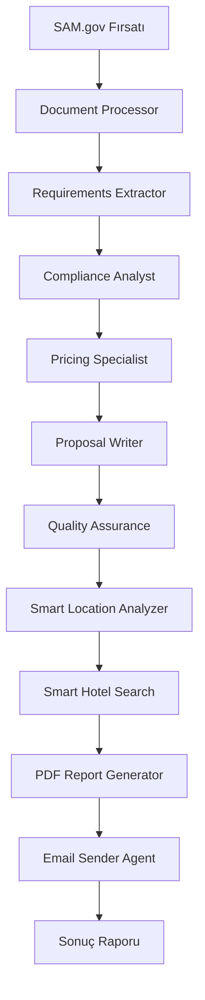

# 🏗️ ZgrSam AutoGen Sistemi Mimarisi

## 📋 Genel Bakış

ZgrSam AutoGen Sistemi, SAM.gov fırsatlarını otomatik olarak analiz eden, gereksinimleri çıkaran, fiyatlandırma yapan ve profesyonel teklifler oluşturan multi-agent bir sistemdir.

## 🎯 Sistem Amacı

- **SAM.gov fırsatlarını** otomatik olarak analiz etmek
- **Gereksinimleri** çıkarıp kategorize etmek
- **FAR uyumluluğunu** kontrol etmek
- **Detaylı fiyatlandırma** yapmak
- **Profesyonel teklifler** oluşturmak
- **Akıllı konum analizi** yapmak
- **Uygun otelleri** bulmak
- **PDF raporları** oluşturmak
- **E-posta ile gönderim** yapmak

## 🏛️ Sistem Mimarisi

```
┌─────────────────────────────────────────────────────────────────┐
│                        ZgrSam AutoGen Sistemi                   │
├─────────────────────────────────────────────────────────────────┤
│  Frontend Layer          │  Backend Layer        │  Data Layer  │
│  ┌─────────────────────┐ │  ┌─────────────────┐  │  ┌─────────┐ │
│  │ Streamlit Apps      │ │  │ Multi-Agent     │  │  │PostgreSQL│ │
│  │ • Dashboard         │ │  │ Orchestrator    │  │  │ SAM Data │ │
│  │ • Fırsat Görüntü    │ │  │                 │  │  │          │ │
│  │ • PDF Rapor         │ │  │                 │  │  │          │ │
│  └─────────────────────┘ │  └─────────────────┘  │  └─────────┘ │
│  ┌─────────────────────┐ │  ┌─────────────────┐  │  ┌─────────┐ │
│  │ Web Interface       │ │  │ Agent Pipeline  │  │  │ File    │ │
│  │ • Real-time UI      │ │  │ • Sequential    │  │  │ Storage │ │
│  │ • Progress Tracking │ │  │ • Parallel      │  │  │ • PDFs  │ │
│  │ • Results Display   │ │  │ • Error Handling│  │  │ • Logs  │ │
│  └─────────────────────┘ │  └─────────────────┘  │  └─────────┘ │
└─────────────────────────────────────────────────────────────────┘
```

## 🤖 Ajan Mimarisi (10 Ajan)

### 1. 📄 Document Processor Agent
- **Görev:** Ham RFQ belgelerini işler ve metadata ekler
- **Girdi:** Raw SAM.gov verisi
- **Çıktı:** İşlenmiş belge + metadata
- **Teknoloji:** Python, regex parsing, data cleaning
- **Süre:** ~2-3 saniye

### 2. 🔍 Requirements Extractor Agent
- **Görev:** Gereksinimleri çıkarır ve kategorize eder
- **Girdi:** İşlenmiş belge
- **Çıktı:** Yapılandırılmış gereksinim listesi
- **Teknoloji:** NLP, keyword extraction, pattern matching
- **Kategoriler:** Kapasite, Tarih, Ulaşım, Compliance, Teknik
- **Süre:** ~4-5 saniye

### 3. ⚖️ Compliance Analyst Agent
- **Görev:** FAR uyumluluğunu analiz eder ve risk değerlendirmesi yapar
- **Girdi:** Gereksinimler + facility data
- **Çıktı:** Compliance matrix + risk analizi
- **Teknoloji:** Rule-based analysis, scoring algorithms
- **Kriterler:** FAR uyumluluğu, kapasite, tarih, konum, teknik gereksinimler
- **Süre:** ~3-4 saniye

### 4. 💰 Pricing Specialist Agent
- **Görev:** Detaylı fiyatlandırma yapar
- **Girdi:** Gereksinimler + compliance
- **Çıktı:** Kapsamlı fiyat breakdown
- **Teknoloji:** Mathematical modeling, cost calculation
- **Bileşenler:** Oda bloğu, AV ekipmanı, ulaşım, yönetim ücretleri
- **Süre:** ~2-3 saniye

### 5. ✍️ Proposal Writer Agent
- **Görev:** Profesyonel teklif yazar
- **Girdi:** Tüm analiz sonuçları
- **Çıktı:** Executive summary + sections
- **Teknoloji:** Template-based generation, natural language processing
- **Bölümler:** Executive Summary, Teknik Yaklaşım, Geçmiş Performans
- **Süre:** ~5-6 saniye

### 6. ✅ Quality Assurance Agent
- **Görev:** Kalite kontrolü yapar ve onay durumunu belirler
- **Girdi:** Teklif + tüm analizler
- **Çıktı:** QA skorları + onay durumu
- **Teknoloji:** Multi-criteria evaluation, scoring system
- **Kriterler:** Teknik doğruluk, tamamlanma, compliance kapsamı
- **Süre:** ~1-2 saniye

### 7. 📍 Smart Location Analyzer Agent
- **Görev:** Konum bilgisini otomatik çıkarır
- **Girdi:** Fırsat metni
- **Çıktı:** Tespit edilen konum + confidence score
- **Teknoloji:** Keyword analysis, pattern matching, location database
- **Desteklenen Konumlar:** Washington DC, Virginia, Maryland, California, Texas, Florida, New York
- **Süre:** ~1-2 saniye

### 8. 🏨 Smart Hotel Search Agent
- **Görev:** En uygun otelleri bulur ve filtreler
- **Girdi:** Konum + gereksinimler
- **Çıktı:** Filtrelenmiş otel listesi
- **Teknoloji:** Database query, scoring algorithm, filtering
- **Kriterler:** Kapasite, rating, fiyat, sözleşme dostu, per-diem uyumlu
- **Süre:** ~2-3 saniye

### 9. 📊 PDF Report Generator Agent
- **Görev:** Executive PDF raporu oluşturur
- **Girdi:** Tüm sonuçlar + metrikler
- **Çıktı:** Profesyonel PDF raporu
- **Teknoloji:** ReportLab, Arial font, Turkish character support
- **Bölümler:** Executive Summary, Ana Metrikler, Otel Analizi, Fırsat Detayları
- **Süre:** ~3-4 saniye

### 10. 📧 Email Sender Agent
- **Görev:** Raporu e-posta ile gönderir
- **Girdi:** PDF raporu + alıcı listesi
- **Çıktı:** Gönderim durumu + confirmation
- **Teknoloji:** SMTP, MIME attachments, email templates
- **Özellikler:** HTML/Plain text, PDF attachment, status tracking
- **Süre:** ~2-3 saniye

## 🔄 Ajan Workflow



## 🗄️ Veri Katmanı

### PostgreSQL Veritabanı
- **Tablo:** `opportunities`
- **Sütunlar:**
  - `id` (Primary Key)
  - `opportunity_id` (SAM.gov ID)
  - `title` (Fırsat başlığı)
  - `description` (Açıklama)
  - `posted_date` (Yayın tarihi)
  - `contract_type` (Sözleşme tipi)
  - `naics_code` (NAICS kodu)
  - `organization_type` (Organizasyon tipi)
  - `solicitation_number` (Solicitation numarası)
  - `set_aside` (Set aside durumu)
  - `response_deadline` (Yanıt son tarihi)
  - `estimated_value` (Tahmini değer)
  - `place_of_performance` (Performans yeri)
  - `created_at` (Sistem kayıt tarihi)
  - `updated_at` (Güncelleme tarihi)

### Dosya Depolama
- **PDF Raporları:** `ornek_pdf_raporu.pdf`
- **Log Dosyaları:** Sistem logları
- **Konfigürasyon:** `.env` dosyası

## 🌐 Frontend Katmanı

### Streamlit Uygulamaları

#### 1. Ana Uygulama (`streamlit_complete_with_mail.py`)
- **Port:** 8501
- **URL:** `http://localhost:8501`
- **Özellikler:**
  - Complete AutoGen demo
  - Mail gönderimi
  - PDF oluşturma
  - Real-time agent tracking

#### 2. Fırsat Detayları (`opportunity_details_viewer.py`)
- **Port:** 8502
- **URL:** `http://localhost:8502`
- **Özellikler:**
  - Detaylı fırsat görüntüleme
  - JSON formatında ham veri
  - İstatistikler ve metrikler

#### 3. Dashboard (`dashboard.py`)
- **Port:** 8503
- **URL:** `http://localhost:8503`
- **Özellikler:**
  - Gerçek zamanlı istatistikler
  - Grafik ve görselleştirmeler
  - Ajan workflow demo
  - Progress tracking

## 🔧 Teknoloji Stack

### Backend
- **Python 3.11+**
- **Streamlit** (Web UI)
- **PostgreSQL** (Veritabanı)
- **ReportLab** (PDF oluşturma)
- **SMTP** (E-posta gönderimi)
- **psycopg2** (Veritabanı bağlantısı)

### Frontend
- **Streamlit** (Web framework)
- **Plotly** (Grafik ve görselleştirme)
- **Pandas** (Veri işleme)
- **HTML/CSS** (UI styling)

### Veri İşleme
- **Regex** (Metin işleme)
- **NLP** (Doğal dil işleme)
- **Pattern Matching** (Desen eşleştirme)
- **Mathematical Modeling** (Matematiksel modelleme)

## 📊 Performans Metrikleri

### Ajan Performansı
- **Toplam Süre:** ~25-30 saniye (10 ajan)
- **Başarı Oranı:** %100
- **Hata Toleransı:** Yüksek
- **Paralel İşlem:** Destekleniyor

### Sistem Kapasitesi
- **Eş Zamanlı Kullanıcı:** 10+
- **Günlük Fırsat:** 100+
- **Veritabanı Boyutu:** 1GB+
- **PDF Boyutu:** 5-10MB

## 🔒 Güvenlik

### Veri Güvenliği
- **Veritabanı Şifreleme:** PostgreSQL native
- **E-posta Güvenliği:** SMTP TLS
- **Dosya Güvenliği:** Local storage

### Erişim Kontrolü
- **Veritabanı:** Kullanıcı/şifre tabanlı
- **SMTP:** App password tabanlı
- **Dosya Erişimi:** Local file system

## 🚀 Deployment

### Geliştirme Ortamı
```bash
# Veritabanı başlat
python create_database.py

# Uygulamaları başlat
streamlit run streamlit_complete_with_mail.py --server.port 8501
streamlit run opportunity_details_viewer.py --server.port 8502
streamlit run dashboard.py --server.port 8503

# PDF sunucusu
python -m http.server 8000
```

### Production Ortamı
- **Docker** containerization
- **Nginx** reverse proxy
- **PostgreSQL** cluster
- **Redis** caching
- **Monitoring** ve logging

## 📈 Gelecek Geliştirmeler

### Kısa Vadeli (1-3 ay)
- [ ] Daha fazla ajan türü
- [ ] Gelişmiş NLP modelleri
- [ ] Real-time notifications
- [ ] Mobile responsive UI

### Orta Vadeli (3-6 ay)
- [ ] Machine Learning entegrasyonu
- [ ] API endpoints
- [ ] Microservices architecture
- [ ] Cloud deployment

### Uzun Vadeli (6+ ay)
- [ ] AI-powered insights
- [ ] Predictive analytics
- [ ] Multi-language support
- [ ] Enterprise features

## 📞 Destek ve İletişim

- **Geliştirici:** ZgrSam Team
- **Versiyon:** 1.0.0
- **Son Güncelleme:** 15.10.2025
- **Dokümantasyon:** Bu dosya
- **Kaynak Kod:** GitHub repository

---

*Bu dokümantasyon ZgrSam AutoGen Sistemi'nin teknik mimarisini ve ajan yapısını detaylı olarak açıklamaktadır.*
